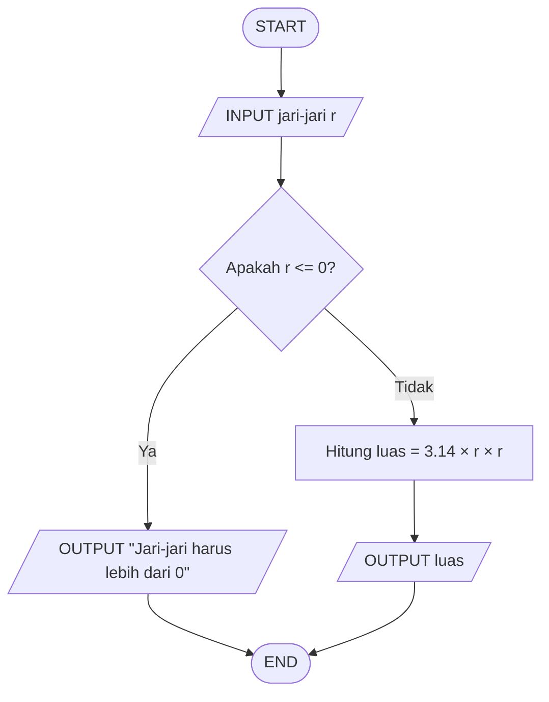

# 🟢 Menghitung Luas Lingkaran

## 📝 **Deskripsi Masalah**

Diberikan sebuah lingkaran dengan ukuran jari-jari tertentu. Untuk mengetahui luas lingkaran tersebut, dilakukan perhitungan menggunakan rumus L = π × r². Program akan menerima nilai jari-jari sebagai input, kemudian mengolah nilai tersebut untuk mendapatkan luas lingkaran. Hasil perhitungan luas akan ditampilkan sebagai output.

## 📥 **Input-Proses-Output**

**Input:** Jari-jari lingkaran (r).

**Proses:** Program menghitung luas lingkaran menggunakan rumus:

**Luas = π × r²**

dengan π = 3,14.

**Output:** Hasil luas lingkaran.

## 💻 **Pseudocode**

```text
INPUT r

IF r <= 0 THEN
    OUTPUT "Jari-jari harus lebih dari 0"
ELSE
    luas = 3.14 * r * r
    OUTPUT luas
END IF
```

## 📊 **Flowchart**



## 🧪 **Test Case**

| Test Case | Input Jari-jari | Kondisi | Hasil yang Diharapkan |
|---|---:|---|---:|
| 1 | 7 | r > 0 | 153.86 |
| 2 | 10 | r > 0 | 314.0 |
| 3 | 5 | r > 0 | 78.5 |
| 4 | 0 | r <= 0 | Jari-jari harus lebih dari 0 |

## 🐍 **Implementasi Python**

Program dibuat menggunakan bahasa pemrograman Python dan dijalankan melalui Visual Studio Code.

Source code dapat dilihat pada **[main.py](main.py)**.

## 📸 **Hasil Pengujian**

Program telah berhasil diuji menggunakan beberapa nilai jari-jari yang sesuai dengan test case, dan menghasilkan kondisi yang sudah ditentukan
