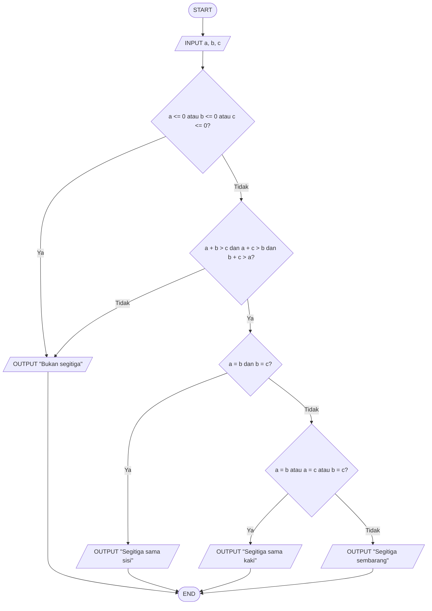

# 🔺 Menentukan Jenis Segitiga Berdasarkan Panjang Sisi

## 📝 **Deskripsi Masalah**

Diberikan tiga buah panjang sisi, yaitu sisi a, b, dan c. Tidak semua tiga panjang sisi dapat membentuk sebuah segitiga, sehingga perlu dilakukan pemeriksaan berdasarkan syarat pembentukan segitiga. Jika ketiga sisi memenuhi syarat tersebut, program akan menentukan jenis segitiga berdasarkan kesamaan panjang sisinya, yaitu segitiga sama sisi, segitiga sama kaki, atau segitiga sembarang.

Program ini dibuat menggunakan percabangan untuk mengevaluasi setiap kondisi dan menampilkan hasil sesuai dengan tiga panjang sisi yang dimasukkan oleh pengguna.

## 📥 **Input-Proses-Output**

**Input:** Tiga panjang sisi segitiga, yaitu a, b, dan c.

**Proses:** Program memeriksa apakah ketiga sisi lebih dari 0 dan memenuhi syarat pembentukan segitiga. Setelah itu, program menentukan jenis segitiga berdasarkan kesamaan panjang sisinya.

**Output:** Jenis segitiga atau keterangan bahwa ketiga sisi bukan merupakan segitiga.

## 💻 **Pseudocode**

```text
INPUT a
INPUT b
INPUT c

IF a <= 0 OR b <= 0 OR c <= 0 THEN
    OUTPUT "Bukan segitiga"

ELSE IF a + b <= c OR a + c <= b OR b + c <= a THEN
    OUTPUT "Bukan segitiga"

ELSE IF a = b AND b = c THEN
    OUTPUT "Segitiga sama sisi"

ELSE IF a = b OR a = c OR b = c THEN
    OUTPUT "Segitiga sama kaki"

ELSE
    OUTPUT "Segitiga sembarang"

END IF
```

## 📊 **Flowchart**



## 🧪 **Test Case**

| Test Case | Input a | Input b | Input c | Kondisi | Hasil yang Diharapkan |
|---|---:|---:|---:|---|---|
| 1 | 5 | 5 | 5 | Ketiga sisi sama | Segitiga sama sisi |
| 2 | 5 | 5 | 7 | Dua sisi sama | Segitiga sama kaki |
| 3 | 4 | 5 | 6 | Ketiga sisi berbeda | Segitiga sembarang |
| 4 | 2 | 3 | 6 | Tidak memenuhi syarat segitiga | Bukan segitiga |

## 🐍 **Implementasi Python**

Implementasi program dibuat menggunakan bahasa pemrograman Python dan dijalankan melalui Visual Studio Code.

Source code dapat dilihat pada **[main.py](main.py)**.


## 📸 **Hasil Pengujian**

Program telah diuji menggunakan beberapa kombinasi panjang sisi sesuai dengan test case yang telah ditentukan. Hasil pengujian menunjukkan bahwa program dapat menentukan jenis segitiga dengan benar berdasarkan panjang ketiga sisi yang dimasukkan.


